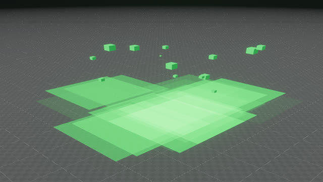
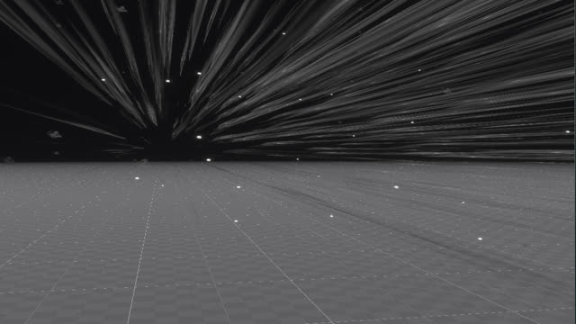

# Example projects

| Example                                                                          | Open on editor                              |
| -------------------------------------------------------------------------------- | ------------------------------------------- |
| 
 Explosion
 | `cargo editor -- examples/3d-explosion.ron` |
| 
 Magic Puff
  | `cargo editor -- examples/magic-puff.ron`   |
| 
 Rain
              | `cargo editor -- examples/rain.ron`         |
| 
 Acid Pool
    | `cargo editor -- examples/acid-pool.ron`         |
| 
 Windy Snow
    | `cargo editor -- examples/windy-snow.ron`         |

## License

All the example projects above are licensed under [CC0](https://creativecommons.org/publicdomain/zero/1.0/). They can be used for free on personal, educational, and commercial projects, without crediting.
